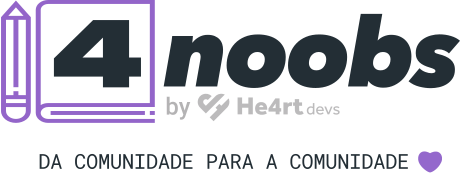

  

<h1 align="center">He4rtLabs - Série 4Noobs</h1>

  <a href="https://twitter.com/He4rtDevs">Twitter</a>
  · 
  <a href="https://discord.gg/he4rt">Comunidade</a>
  ·
  <a href="https://instagram.com/heartdevs">Instagram</a>
  ·
  <a href="https://www.facebook.com/groups/he4rt/">Facebook</a>

O intuito deste repositório é mostrar projetos desenvolvidos para facilitar o estudos dos devs iniciantes feitos pela nossa comunidade!

### 💡 Linguagens de programação

| Nome | Descrição | Contribuidores | Link |
| ------ | ------ | ------ | ------ |
| Assembly | Aprenda sobre a linguagem mais interessante para Engenharia Reversa. | [André Luís](https://github.com/andreluispy) | [Clique aqui ➡️](https://github.com/andreluispy/assembly4noobs) |
| Bash | Aprenda a linguagem de script básica do seu sistema UNIX. | [Bruno Dantas de Paiva](https://github.com/DantasB) - [Gabriel Thiago](https://github.com/gth1ago) | [Clique aqui ➡️](https://github.com/DantasB/Bash4Noobs) |
| C | Entendendo o básico para começar a programar na linguagem C. | [João Paulo Lima](https://github.com/jpaulohe4rt) - [Paulo Rievrs Oliveira](https://github.com/paulorievrs) | [Clique aqui ➡️](https://github.com/jpaulohe4rt/c4noobs) |
| C++ | Esse tutorial tem como objetivo principal apresentar e ensinar a linguagem de programação C++ de uma maneira fácil, descomplicada e acessível para todos. | [Giovane Cardoso](https://github.com/novout) - [Thiago Rezende](https://github.com/thiago-rezende) - [PoorlyDefinedBehaviour](https://github.com/PoorlyDefinedBehaviour) | [Clique aqui ➡️](https://github.com/Novout/cpp4noobs) |
| C# | A ideia é passar aos iniciantes conhecimentos básicos da maneira mais simples possível. | [Bruno Dantas de Paiva](https://github.com/DantasB) - [Logikoz](https://github.com/Logikoz) - [Eduardo Cabral](https://github.com/eduardosbcabral) | [Clique aqui ➡️](https://github.com/DantasB/CSharp4Noobs) |
| Clojure | Conheça Clojure, uma linguagem de programação funcional, elegante, baseada em Lisp e *parceira* da JVM. | [João Lanjoni](https://github.com/lanjoni) | [Clique aqui ➡️](https://github.com/lanjoni/clojure4noobs) |
| Crystal | Conheça Crystal, uma linguagem para humanos e computadores, com muito potencial e interações semelhantes ao Ruby. | [João Lanjoni](https://github.com/lanjoni) | [Clique aqui ➡️](https://github.com/lanjoni/crystal4noobs) |
| CSS | Ensinar o básico de CSS para você poder aplicar os conhecimentos para estilizar páginas e websites com qualidade. | [Matheus Henrique](https://github.com/mathh95) - [Guilherme Vieira](https://github.com/gitlherme) - [Gabriel Angelo](https://github.com/morninn) - [Igor Wessel](https://github.com/igorwessel) - [Novout](https://github.com/Novout)| [Clique aqui ➡️](https://github.com/he4rt/css4noobs) |
| Dart | Tutorial de Dart para iniciantes na Linguagem. | [Patrick Sasso](https://github.com/pksasso)| [Clique aqui ➡️](https://github.com/pksasso/dart4noobs) |
| Elixir | Esse projeto tem como objetivo auxiliar todos os desenvolvedores iniciantes na programação funcional. | [Alexandre de Souza](https://github.com/aleDsz) | [Clique aqui ➡️](https://github.com/aleDsz/elixir4noobs) |
| Go | Um guia que irá ajudar a melhorar seus conhecimentos em golang | [Caio Almeida](https://github.com/caioreix/) | [Clique aqui ➡️](https://github.com/caioreix/go4noobs#go4noobs) |
| HTML | Aprenda sobre a linguagem de marcação mais utilizada na construção de páginas na Web. | [Lucas](https://github.com/sorenhe4rt) - [Pedro Paulo](https://github.com/ZxPedro) - [Luis Eduardo](https://github.com/Luisnadachi) - [Renato](https://github.com/SrRenato) | [Clique aqui ➡️](https://github.com/sorenhe4rt/HTML4Noobs)
| XML | Aprenda sobre a linguagem de marcação XML | [Otávio de Carvalho](https://github.com/atomotavio) | [Clique aqui ➡️](https://github.com/atomotavio/XML4Noobs) |
| Java | Tutorial De Java para iniciantes na Linguagem. | [Paulo Rievrs Olviera](https://github.com/paulorievrs) | [Clique aqui ➡️](https://github.com/paulorievrs/java4noobs) |
| Javascript | Tutorial de Javascript para iniciantes na linguagem. | [Thiago Della Noce](https://github.com/ThiagoDellaNoce) | [Clique aqui ➡️](https://github.com/ThiagoDellaNoce/javascript4noobs) |
| Markdown | É ensinar o básico de Markdown para iniciantes para poderem aplicar em diversos projetos dando uma cara melhor ao README.md ou ao que for. | [João Paulo Lima](https://github.com/jpaulohe4rt) - [Daniel Moura](https://twitter.com/dsm_uix) - [Gustavo Lins](https://github.com/freazesss) - [Eduardo Cabral](https://github.com/ferroeduardo) | [Clique aqui ➡️](https://github.com/jpaulohe4rt/markdown4noobs) |
| Making Languages | Aprenda a criar Linguagens de Programação | [André Luís](https://github.com/andreluispy) | [Clique aqui ➡️](https://github.com/andreluispy/makinglanguages4noobs)
| OCaml | Tutorial de OCaml para iniciantes na Linguagem. | [Camilo Cunha de Azevedo](https://github.com/Camilotk) | [Clique aqui ➡️](https://github.com/Camilotk/ocaml4noobs)
| Perl | Tutorial de Perl para iniciantes na linguagem. | [priv](https://github.com/scriptprivate/) | [Clique aqui ➡️](https://github.com/scriptprivate/perl4noobs)   
| PHP | Tutorial de PHP para iniciantes na linguagem. | [Daniel Reis](https://github.com/DanielHe4rt) - [Daniel Rodrigues](https://github.com/geekcom) |  [Clique aqui ➡️](https://github.com/DanielHe4rt/php4noobs) |
| Python | Tutorial de Python para que você aprenda mais sobre uma linguagem que está sempre crescendo e trazendo inovações. | [Wendrew Oliveira](https://github.com/wendrewdevelop) - [Matheus Morata](https://github.com/MatheusMorata) | [Clique aqui ➡️](https://github.com/wendrewdevelop/python4noobs)   
| R | Aprenda um pouco mais sobre essa linguagem mais voltada a análise e visualização de dados. | [Alexandre de Souza](https://github.com/aleDsz) - [Rafael Salandin](https://github.com/Salandin) | [Clique aqui ➡️](https://github.com/Salandin/r4noobs) |
| Rust |Introdução a linguagem de programação Rust, o objetivo deste repositório é inserir o leitor aos conceitos da linguagem Rust, como o seu modo de gerenciamento de memória e conceitos da linguagem. | [Paulo Gabriel Justino Bezerra](https://github.com/pgjbz) | [Clique aqui ➡️](https://github.com/pgjbz/rust4noobs) |
| Ruby | Introdução a linguagem de programação Ruby, entendendo o básico para começar a programar na linguagem Ruby. | [Kaique Linhares Sousa](https://github.com/rinyaresu) | [Clique aqui ➡️](https://github.com/rinyaresu/ruby4noobs) |
| Swift | Introdução a linguagem de programação Swift para quem está começando no desenvolvimento iOS. | [Giovanna Moeller](https://github.com/giovannamoeller)  | [Clique aqui ➡️](https://github.com/giovannamoeller/swift4noobs) |
| Typescript | Adicione tipagem estática ao seu código Javascript. | [Carolina Ale](https://github.com/Carolis) - [Matheus Pessanha](https://github.com/Mdsp9070) - [Matheus Navarro](https://github.com/navarrotheus) | [Clique aqui ➡️](https://github.com/Carolis/typescript4noobs) |
| Haskell | Único roadmap de Haskell possível, do noob ao Thanos. | [Guilherme dos Reis Meira](https://github.com/Guilherme775) - [Camilo Cunha de Azevedo](https://github.com/Camilotk) - [Miguel Gomes](https://github.com/miguel-nascimento) - [Matheus de Souza Pessanha](https://github.com/matdsoupe) - [Samuel Durante](https://github.com/samueldurantes) - [Lucas Alexander Floriani](https://github.com/lucasfloriani) | [Clique aqui ➡️](https://github.com/Guilherme775/Haskell4Noobs) |
| Kotlin | Tutorial de Kotlin para iniciantes na linguagem. | [Gustavo Freze](https://github.com/gustavofreze)  | [Clique aqui ➡️](https://github.com/gustavofreze/kotlin4noobs) |

<!---| Batch | Aprenda a codar no terminal com o esse 4noobs de Batch. | [Caio Almeida](https://github.com/caioreix/) |  |
| GraphQL | Aprenda a fazer querys com qualidade com uma das principais tecnologias do mercado | [Guilherme Ananias](https://github.com/guiananias) - [Vitória Tenório](https://github.com/vitenorio) |  |
| NodeJS | Faça API's e integrações com um código limpo e com soluções inteligentes. | [Ana Bastos](https://github.com/anabastos) - [Bruno](https://github.com/PoorlyDefinedBehaviour) - [Hugo](https://github.com/hugogomess) |  |
| Rust  | Aprenda mais uma linguagem funcional e pense diferente do padrão. | [Renan Felipe](https://github.com/orenan) |  | -->

### 📦 Frameworks

| Nome    | Descrição                                                                                                                                                 | Contribuidores                                  | Link |
|---------|-----------------------------------------------------------------------------------------------------------------------------------------------------------|-------------------------------------------------| ------ |
| Angular | O Angular é um poderoso framework de desenvolvimento de aplicações front-end mantido pela equipe do Google. Ele permite a criação de aplicações web dinâmicas, responsivas e de alto desempenho. Nesse repositório você terá em mãos todos os materiais para iniciar sua jornada nessa tecnologia muito requisitada no mercado! | [Gustavo Bizo](https://github.com/gbiz0) | [Clique aqui ➡️](https://github.com/gbiz0/angular4noobs) |
| NextJS  | Tutorial e documentação de Next.js traduzido em português para iniciantes em programação.                                                                 | [Caio Almeida](https://github.com/caioreix/)    | [Clique aqui ➡️](https://github.com/caioreix/NextJs4noobs) |
| Vue     | Esse tutorial tem como objetivo principal apresentar e ensinar o básico do framework Vue em sua versão 2, de uma maneira completa e acessível para todos. | [Giovane Cardoso](https://github.com/Novout)    | [Clique aqui ➡️](https://github.com/Novout/vue4noobs/) |
| Flutter | Introdução ao framework Flutter. Aprenda sobre Flutter, Widgets, Gerenciamento de Estado e a importância da Orientação a Objetos dentro dessa tecnologia. | [Felipe Ribeiro](https://github.com/feliperfdev) | [Clique aqui ➡️](https://github.com/feliperfdev/flutter4noobs) |
| Django  | Tutorial básico sobre o framework Django. Aprenda sobre configurações de projeto, módulos, arquitetura MTV, Models, Views e Templates.                    | [Bruno Vieira](https://github.com/brunovhk)   | [Clique aqui ➡️](https://github.com/brunovhk/django4noobs) |
| Spring  | Conheça o Spring framework e os demais projetos do ecossistema. Aprenda a criar um projeto Spring na prática. | [Edclydson Sousa](https://github.com/edclydson)   | [Clique aqui ➡️](https://github.com/edclydson/Spring4noobs) |
| NestJS | O NestJS é um poderoso framewrkor que auxilia na construção de aplicações em NodeJS do lado do servidor eficientes e escalonáveis. Este é um guia que irá auxiliar iniciantes a começar a estudar e se aprimorar nesta incrivel ferramenta. | [Victor Geruso Gomes](https://github.com/vgeruso) - [João Vitor De Jesus Oliveira](https://github.com/joaovjo) | [Clique aqui ➡️](https://github.com/vgeruso/nestjs4noobs) |

### 🔧 Ferramentas

| Nome | Descrição | Contribuidores | Link |
| ------ | ------ | ------ | ------ |
| Git | A ideia é ensinar para os usuários iniciantes que o Git não é nenhum "monstro" de se aprender e também ensinar como usar num ambiente onde há mais de um desenvolvedor atuando no projeto sem desorganizar ou perder algum traço de código no processo. | [Daniel Reis](https://github.com/danielhe4rt) | [Clique aqui ➡️](https://github.com/DanielHe4rt/git4noobs) |
| RegEx | Aprenda o básico de expressões regulares e porque estão presentes em diversos editores de textos. | [NiumXp](https://github.com/NiumXp) | [Clique aqui ➡️](https://github.com/NiumXp/regex4noobs) |
| Vim | Quem nunca entrou no Vim e não deu conta de sair? Pois bem, aqui você irá aprender um pouco a mais do que sair. Não ache que só ler você irá aprender, para realmente aprender precisará de praticar e muito! | [Luan Mateus](https://github.com/hellowluan) | [Clique aqui ➡️](https://github.com/hellowluan/vim4noobs) |
| WM | Vire um mestre do Linux usando Window Manager. Você irá maximizar sua produtividade e se tornar um expert no mundo Linux. | [Geraldo](https://github.com/gerald0x01) | [Clique aqui ➡️](https://github.com/gerald0x01/wm4noobs)
| WSL2 | Utilize Linux e Windows sem precisar de Dual Boot com o Windows Subsystem for Linux | [Rafael Salandin](https://github.com/Salandin) | [Clique aqui ➡️](https://github.com/Salandin/wsl4noobs)
| Obsidian | App que oferece recursos avançados de organização e conexão de notas utilizando markdown para ajudá-lo a gerenciar seu conhecimento.  | [Gabi Lima](https://github.com/gabibits) | [Clique aqui ➡️](https://github.com/gabibits/obsidian4noobs)
<!---| Clean Code | Aprenda a escrever códigos de forma simplificada e limpa. | [Allan Pires](https://github.com/allan-pires) |  |
| Design Patterns | Aprenda padrões de código para resolução de problemas comuns da forma correta. | [Alexander Santos](https://github.com/ronkiro) |  |
| Docker | Aprenda a subir containers de forma simples. | [Thiago Rezende](https://github.com/thiago-rezende) |  |-->

### 💻 Sistemas operacionais

| Nome | Descrição | Contribuidores | Link |
| ------ | ------ | ------ | ------ |
| Arch Linux | Tutorial De Instalação da distribuição ArchLinux. | [Lucas Silva](https://github.com/LucasHe4rt) | [Clique aqui ➡️](https://github.com/LucasHe4rt/ArchLinux4noobs) |
| Linux | Tutorial De Linux para iniciantes em Programação. | [Francisco Paradella](https://github.com/FranOnRails) - [Lucas Silva](https://github.com/LucasHe4rt) - [Marco Antonio](https://github.com/marcopandolfo) | [Clique aqui ➡️](https://github.com/lucashe4rt/linux4noobs) |

### 🎨 Design

| Nome | Descrição | Contribuidores | Link |
| ------ | ------ | ------ | ------ |
| UI | Tutorial tem como objetivo principal apresentar e ensinar o básico do UI Design, de uma maneira completa e acessível para todos. | [Felipe Gabriel](https://twitter.com/FelipeG7K) - [Gabriel Vieira](https://twitter.com/NexHe4rt) | [Clique aqui ➡️](https://github.com/IUX7K/ui4noobs) |
| UX | Esse tutorial tem como objetivo principal apresentar e ensinar o básico do UX Design, de uma maneira completa e acessível para todos. | [Felipe Gabriel](https://twitter.com/FelipeG7K) | [Clique aqui ➡️](https://github.com/IUX7K/ux4noobs/) |

### 🎲 Banco de dados 
| Nome | Descrição | Contribuidores | Link |
| ------ | ------ | ------ | ------ |
| MySQL | Aprenda a manipular o banco de dados no MySQL | [Paulo Rievrs](https://github.com/paulorievrs) | [Clique aqui ➡️](https://github.com/paulorievrs/mysql4noobs) |
| MongoDB | Aprenda a manipular o banco de dados noSQL MongoDB | [Carlos Daniel](https://github.com/carlosdnba) | [Clique aqui ➡️](https://github.com/carlosdnba/mongodb4noobs) |
| PostgreSQL | Aprenda a manipular o banco de dados no PostgreSQL | [Rômulo Silva](https://github.com/RomuloHe4rt) | [Clique aqui ➡️](https://github.com/rohlacanna/postgresql4noobs) |
| SQL | Aprenda a trabalhar com banco de dados relacionais com SQL. | [Luis Eduardo "Nadachi"](https://github.com/Luisnadachi) | [Clique aqui ➡️](https://github.com/Luisnadachi/SQL4Noobs) |
| Redis | Introdução ao básico do banco chave-valor in-memory mais famoso do mercado. | [Diego Reis "El Yawd"](https://github.com/el-yawd/) | [Clique aqui ➡️](https://github.com/el-yawd/redis-101) |

<!---| MySQL | Aprenda a manipular o banco de dados no MySQL| [Gabriel Vieira](https://github.com/nextur) |  |
| SQL | Aprenda de uma vez por todas a escrever SQL. | [Caio Almeida](https://github.com/caioreix) - [Fernando Karchiloff](https://github.com/FernandoKGA) |  |

### ☁️ Cloud
| Nome | Descrição | Contribuidores | Link |
| ------ | ------ | ------ | ------ |
| Google Cloud Platform | Introdução aos serviços da Google Cloud Platform | [Leonardo Lima](https://github.com/leozz37) |  |-->

### 📌 Paradigmas de programação
| Nome | Descrição | Contribuidores | Link |
| ------ | ------ | ------ | ------ |
| POO | Aprenda o básico sobre programação orientada a objetos | [Otávio de Carvalho](https://github.com/atomotavio) | [Clique aqui ➡️](https://github.com/atomotavio/POO4Noobs) |

### 🤖 Diversos

| Nome | Descrição | Contribuidores | Link |
| ------ | ------ | ------ | ------ |
| QA | Tenha uma introdução completa a estudos sobre testes e qualidade de software. | [Victor Manoel](https://github.com/VictorMPicoli) - [Victor Wildner](https://github.com/vcwild) | [Clique aqui ➡️](https://github.com/vcwild/qa4noobs) |
| DevOps | Aprenda e pratique a cultura DevOps | [Lucas Barcat](https://github.com/lbarcat) | [Clique aqui ➡️](https://github.com/lbarcat/DevOps4noobs) |
| Acessibilidade na Web | Esse Repositório tem como objetivo principal apresentar e ensinar sobre acessibilidade na web. | [Gabriel Teixeira](https://github.com/gabrielbsb21) | [Clique aqui ➡️](https://github.com/Gabrielbsb21/acessibilidade4Noobs) |

### 🎓 Certificações

| Nome | Descrição | Contribuidores | Link |
| ------ | ------ | ------ | ------ |
| LPI | Uma guia completo para sua primeira certificação da Linux Professional Institute. | [João Lanjoni](https://github.com/lanjoni) | [Clique aqui ➡️](https://github.com/lanjoni/lpi4noobs) |

---

<strong> Da comunidade para a comunidade. 💜</strong>

